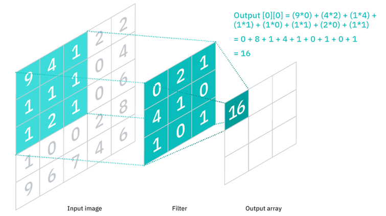

# Convolutional Neural Networks Explained
Computer vision is a subset of machine learning which involves deep learning models learning from digital imagery and videos to complete a given task. The task could be to simply identify the correct animal in a certain picture (classification) or to convert an image to a higher resolution (regression). Computer vision has a multitude of applications and researches are creating new architectures all the time to out perform the last, the simplist however is the Convolutional Neural Network.

A Convolutional Neural Network (ConvNet/CNN) is a deep learning network that has superior performance with image inputs compared to regular neural networks. Before CNNs were created, manual feature extraction methods were used that did not perform anywhere near as well and were very time consuming.

A basic CNN can be split up into three important layers: the convolutional layer, the pooling layer and the fully-connected layer. All three will be explained in detail below so you can understand how a CNN works at each step.

## Convolutional Layer
The convolutional layer is the heart of the CNN architeture, it is where to majority of computations occur. 

