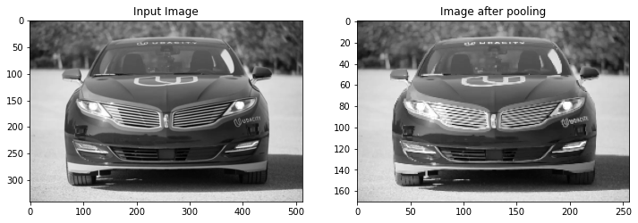

# Convolutional Neural Networks Explained
Computer vision is a subset of machine learning which involves deep learning models learning from digital imagery and videos to complete a given task. The task could be to simply identify the correct animal in a certain picture (classification) or to convert an image to a higher resolution (regression). Computer vision has a multitude of applications and researches are creating new architectures all the time to out perform the last, the simplist however is the Convolutional Neural Network.

A Convolutional Neural Network (ConvNet/CNN) is a deep learning network that has superior performance with image inputs compared to regular neural networks. Before CNNs were created, manual feature extraction methods were used that did not perform anywhere near as well and were very time consuming.

<p align="center">
    
</p>

A basic CNN can be split up into three important layers: the convolutional layer, the pooling layer and the fully-connected layer. All three will be explained in detail below so you can understand how a CNN works at each step.

## Convolutional Layer
The convolutional layer is the heart of the CNN architeture, it is where to majority of computations occur. To imagine how a convolutional layer works it is best to imagine a flashlight shining over the top left of the input image. In this imaginary example the flashlight covers a 5 x 5 area of a 32 x 32 image. This area is known as a <strong>receptive</strong> field and the flashlight is known as the <strong>filter</strong>. The filter is an array of numbers/weights and the dot product of the receptive field and filter is calculated and fed into the output array. Now for the whole image, the flashlight shines on a new section every time calculating the dot product, this is known as <strong>convolving</strong>. The amount of pixels the flashlight moves is known as the <strong>stride</strong>, it can be one or many pixels. When the filter has finished convolving over the whole image, the final output array is the <strong>feature map</strong>.

<p align="center">
    
</p>

Using Keras, a convolutional layer can be specified like this. Here only 1 filter will be applied to the image, but usually multiple will be applied at the same time. A question that is asked frequently is if you have to specify the filter used. The answer is no, during training the filters evolve organically depending on the loss. The network will train once and calculate the loss value, for example to difference between the actual value and the model predicted value. Based on this loss, it will tweek any filters by a small amount and train again until a good filter is finally found. Evidently, you do not need to worry about this filters used just the amount.

```
keras.layers.Conv2D(filters=1, kernel_size=(5,5), strides=1, activation='relu')
```
Using the code above, this car image was passed into the convoltuional layer to visualise how the output looks after a singular convolution. As youc an see harsh lines like the output of the car have been intensified whilst non-important areas like the ground are essentially removed.

<p align="center">
    
</p>

## Pooling Layer
Pooling layers are simple, they downsample the image or reduce the dimensionality. If your inptu image of 32 x 32 is convolved with 16 filters, your current shape is 32 x 32 x 16 which is a very large. To save on computational power, pooling layers are used to reduce this size significantly. This does involve loosing important information as pixels are being removed, however the two types of pooling show that dominant information is still retained.

The first type is max pooling which returns the maximum value for each receptive field visited. Pooling layers work quite similar to convolutional layers where a receptive field slides across the whole image. This time instead of computing the dot product with the filter, max pooling finds the highest value within the receptive field and outputs that to the output array.

The second type is average pooling and that calculates the average value of the receptive field. Max pooling is used more often as it can easily remove noisy data due to it choosing the maximum value or dominant pixel.

To implement max pooling within Keras youc an use to layer below. The only paramter that must be specified is the pool size, this indicates how much the image will be reduced by. A pool size of 2 will reduce the image by half, a pool size of 4 will produce an image a quarter of the size and so on.

```
keras.layers.MaxPooling2D(pool_size=2)
```

The same car image has been passed into the above layer, and as you can see both the x-axis and y-axis have been reduced by half. Plus due to the way max pooling works, important information such as the details of teh car have not been lost during the pooling.

<p align="center">
    
</p>

## Fully-connected Layer
The final layer that needs to be mentioned is the fully connected layer, this is simply a standard neural network added to the end so that a classification or regression task can be made. Adding this allows non-linear combinations of the features found by the convolutional layers to be found. 

To add this to the end of a CNN all that is needed is a Flatten layer, this takes the matrix output by the CNN and flattens it into a singular array which the Dense layers of the neural network can use an an input.

```
keras.layers.Flatten()
keras.layers.Dense(32, activation='relu')
```

## CNN Architecture
As shown before, the standard CNN architecture is a repetition of these layers. Most architectures use a convolutional layer followed by a pooling layer repeated many times with a neural net added on the end. By the last pooling layer the image will be tiny compared to the original passed in.

<p align="center">
    
</p>

## An example CNN task
Now we will run through a whole simple CNN classification task so that you can see everything we have learnt in one simple task. Using the MNIST dataset, we will classify handwritten digits correctly. To see the whole task, check the jupyter notebook supplied in this folder.

First we do the usual data preprocessing that is done on every task and then the CNN itself is specified. My model is quite small compared to common architectures but it is a simple, two convolution blocks and then a fully connected layer at the end. My output is 10 neurons with softmax as there are ten digits that it can possibly predict.

```
def define_model():
    model = Sequential()
    model.add(Conv2D(32, (3, 3), activation='relu', kernel_initializer='he_uniform', input_shape=(28, 28, 1)))
    model.add(MaxPooling2D((2, 2)))
    model.add(Conv2D(64, (3, 3), activation='relu', kernel_initializer='he_uniform'))
    model.add(MaxPooling2D((2, 2)))
    model.add(Flatten())
    model.add(Dense(100, activation='relu', kernel_initializer='he_uniform'))
    model.add(Dense(10, activation='softmax'))
    # compile model
    opt = SGD(learning_rate=0.01, momentum=0.9)
    model.compile(optimizer=opt, loss='categorical_crossentropy', metrics=['accuracy'])
    return model
```

After 5 cross validation runs I get a mean accuracy of 98.9%. To test it I made my model predict an unseen digit which you can see below. And it correctly predicted it is the number 7 showing that my model works great.

<p align="center">
    
</p>

## Conclusion
This article has gone through the fundementals of Convolutional Neural Networks, and I hope you have learnt something from this. If you have then please star this repo as more articles are yet to come.

| Title                                   | Date       | Categories    | Tags                                                                                |
|-----------------------------------------|------------|---------------|-------------------------------------------------------------------------------------|
| Convolutional Neural Networks Explained | 02-05-2022 | Deep Learning | CNN, Computer Vision, Convolutional Neural Networks, Deep Learning, Neural Networks |
