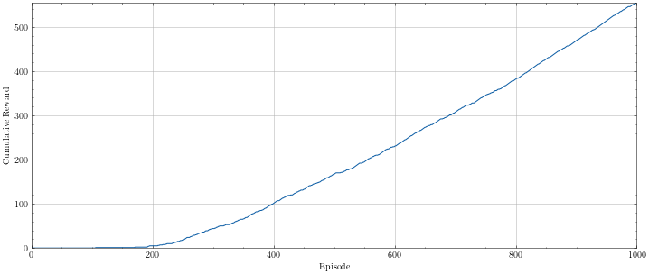

# Reinforcement Learning Explained Using Q Learning
Reinforcement Learning aims to teach an agent to perform a particular task by letting it interact with the environment it is placed in. The agents behaviour is positively or negatively reinforced by a set of rewards it can gain whilst learning. 

It may be helpful to imagine teaching a puppy to sit on command: if it sits when you tell it to then it receives a treat (positive reward), if it does not sit then it gets a slap on the wrist (negative reward). By reinforcing particular behaviours with rewards, the agent will learn to maximise the rewards overtime by doing things that give it a positive reward and avoiding things that give it a negative reward.

<p align="center">
    
</p>

A typical reinforcement learning (RL) algorithm can be formalised using the flowchart above. An agent performs an action within the environment, and it receives a reward of some value and the current state that the environment is in so it can best choose the next action again. The agent has access to a list of possible actions it can take (move forward, jump, etc.) and the current state of the environment. The state is quite abstract and can refer to co-ordinates, a particular grid in a grid environment. If this doesn't make much sense now, it will be visualized later when we look at a real example.

## Q Learning and The Math
To better understand how RL works, we will look at the popular Q Learning algorithm that many RL agents use. Q Learning looks to pick the best action possible by assinging a state action pair a value that determines its quality. Q Learning is a model-free value-based off-policy algorithm, others fall under different categories nad may work very differently but we will look at Q Learning as it is easy to understand and transparent. Before we look at it, let's look at a few equations first.

The Bellman Equation expresses a recursive relationship between the states and their value, the value of a state <em>s</em> is the reward for that state plus the value of the transition state. This equation can be visualised below where <em>V(s)</em> is the value of being in a particular state, <em>a</em> is the action, <em>s</em> is the current state, <em>R(s,a)</em> is the reward for state <em>s</em> and action <em>a</em>, $\gamma$ is the discount factor and <em>s'</em> is the next state after taking the action.

<p align="center">
    
</p>

To visualise how this equation works you can consider the 4x4 grid environment below. The agent start in the top right corner and has to reach the goal at the bottom left. If all the other spaces have a reward of 1 when reaching them then the agent wouldn't know which direction to go to reach the goal (left). The Bellman Equation uses a discount factor to map the value of each state to help choose the optimal route. Looking at the grid environment (right), it is clear which direction to move to no matter which square the agent is in.

<p align="center">
    
</p>

The last equation that we should look at is the Markov Decision Process (MDP). A MDP model decision making in scenarios where outcomes are partially randomised. This equation is shown below, it is very similar to the Bellman Equation but <em>P(s,a,s')</em> is the probability of moving from <em>s</em> to <em>s'</em> with action <em>a</em>.

<p align="center">
    
</p>

Consider the same grid environment shown above. With an MDP, every step the agent takes there is a random possibility it may take a different action all together.

<p align="center">
    
</p>

The example above shows that the optimal move to maximise reward may be to move down, but the agent may behave stochastically and move in a different direction. Due to the random nature of an MDP, it may take longer to reach the intended goal but the optimal path is still clearly mapped out. Why would we want the agent to behave stochastically in some cases? I'll come back to this point soon but first let us look at Q Tables.

As stated previously, Q Learning looks to pick the best action possible based on the current state the agent is in. Using the Bellman Equation, Q Values can be calculated. Q Values tell us the quality of an action from a certain state and these are all stored in a table called a Q Table. The table (left) shows the Q Table updated after a single move, the Q Value was plotted according to the action taken and the state it was in. The table (right) shows an example completed Q Table where it is clear which action to take no matter which state you look at.

<p align="center">
    
</p>

Now this is where we answer why it is best that sometimes the agent moves stochastically. At the start of the training process, it is best if tha agent moves stochastically so that it can visit as many state action pairs as possible. It can visit all of them and improve the Q Value each time it visits a pair. Then close to the end of training, it is best if the agent starts to stop this behaviour and only pick the best actions as to reinforce the better state action pairs. This is called exploration vs exploitation or the Epsilon Greedy Algorithm and we can use $\epsilon$ to determine how likely the agent is to move randomly.

This may be a whole lot of confusing information and it will be easier to run through an example code task to help better understand it all. We will do that but first let's sum up everything. The Q Learning algorithm can be understand as such. The Q Table is initialized with empty values at the start of the training process. Depending on the epsilon greedy algorithm, the agent chooses an action in the sake of exploration or one that gives the highest future reward. After the agent takes the action, it receives a reward and the new updated state from the environment. The state action pair can be mapped in the Q Table and the loop continues for <em>n</em> episodes.

## An example Q Learning Task
Now using everything we have just previosuly learnt, we will create a Q Learning agent within the Frozen Lake environment. To see the whole task, check the jupyter notebook supplied in this folder.

An agent can be created within any domain but to make things simple, we will use a grid environment and specifically, one called Frozen Lake which is supplied by Open AI Gym. Frozen Lake is a 4x4 grid environment that contains a starting point (top left), a few random holes and a goal (bottom right). The aim is for the agent to reach the goal without falling in the hole. Simple enough isn't it!

<p align="center">
    
</p>

To create the environment we use this simple line below. There is an 8x8 version of the map and a slippery vision of each but to keep it simple we will go with this configuration.

```
import gym
env = gym.make("FrozenLake-v1", map_name="4x4", is_slippery=False)
```

We have four actions or directiosn the agent can move in: left, down, right up. There are also 16 possible states which correspond to each cell in the grid environment. Lastly, there is only one reward in this whole game and that is a positive reward of 1 when the agent reaches the goal, this is very rudamental and it is advised to add negative rewards if the agent falls in a hole (terminal state) but again...we are keeping this very simple.

First we can code up the greedy epsilon algorithm that will determine if the agent will move randomly or greedily. Here we generate a random number, if we have not visited the current state before it is added to the Q Table. If the epsilon value spoken about earlier is greater than the random number then a random action is taken from the action space, otherwise the agent picks the action with the highest Q Value. The agent then takes the action picked and the environment gives us back the new state, a reward and if the agent has either reached a terminal state or the goal.

```
def act(state):
    rand = np.random.uniform()
    
    if state not in Q:
        Q[state] = np.zeros((env.action_space.n))
    
    if rand < epsilon:
        action = env.action_space.sample()
    else:
        if state in Q:
            action = np.argmax(Q[state])
        else:
            action = env.action_space.sample()
    
    state, reward, done, _ = env.step(action)
    
    if state not in Q:
        Q[state] = np.zeros((env.action_space.n))
    
    return state, action, reward, done
```

The epsilon value we will use during training starts at 1 and decays over time to a minimum value of 0.1, this is so it can explore the environment for the first half of training and eventually optimise the Q Table for the best route in the latter half. This decay can be visualised below.

<p align="center">
    
</p>

Now for the training loop. The code is quite self explanatory but in summary, we create a loop for the number of training epsiodes we want. The environment is reset and the epsilon value is updated. We create another loop that allows the agent to move each step for a maximum number of steps. The action chooses an action using the Epsilon Greedy Algorithm and updates the Q Table with the new state, the action is took and reward. We set the current state to be the new state and check if the agent reached the goal or fell in a hole. Any metric can also be tracked, in this case I track the cumulative reward over the whole of training and the epsilon value over training.

```
for episode in range(EPISODES):
    state = env.reset()
    
    done = False
    reward_sum = 0
    
    epsilon = min_epsilon + (1 - min_epsilon) * np.exp(-decay * episode)
    
    for step in range(MAX_STEPS):
        new_state, action, reward, done = act(state)
        
        Q[state][action] = Q[state][action] + alpha * (gamma * np.max(Q[new_state]) + reward - Q[state][action])
        
        state = new_state
        
        reward_sum += reward
        
        if done:
            break
        
    if not episode % update_every or episode == 1: 
        train_rewards[episode] = reward_sum
        train_epsilon[episode] = epsilon
```

Once training we can let the agent do a testing run through the environment by making a few tweaks to the loop above. Epsilon is set to 0 so it never behaves randomly, the Q Table is never updated and we print out how many steps it took in total and if it reached the goal or not.

```
epsilon = 0
for episode in range(TESTS):
    state = env.reset()
    
    done = False
    reward_sum = 0
    
    for step in range(MAX_STEPS):
        state, action, reward, done = act(state)
        
        reward_sum += reward
        
        if done:
            break
    
    test_rewards[episode] = reward_sum

print(f'Number of steps taken: {step} - Reached goal? : {"Yes" if test_rewards[0] == 1 else "No"}')
```

And that is a fully trained Q Learning agent. In my example it reached the goal successfuly in 5 steps, that is amazing! Below you can see the cumulative reward over training, it barely ever reaches the goal when acting fully randomly but as epsilon lowers, the agent reaches the goal more!

<p align="center">
    
</p>

## Conclusion
This article has gone through the fundementals of Reinforcement Learning and the Q Learning algorithm. We fully explored both and rand through an example taks to bring everything together. From here, different algorithms can be explored aswell as reward shaping and other cool techniques that I may cover in a future article.
I hope you have learnt something from this. If you have then please star this repo as more articles are yet to come.

| Title                                   | Date       | Categories    | Tags                                                                                |
|-----------------------------------------|------------|---------------|-------------------------------------------------------------------------------------|
| Reinforcement Learning Explained Using Q Learning | 23-05-2022 | Deep Learning | Reinforcement Learning, RL, Deep Learning, Q Learning |
